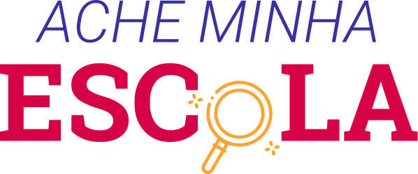

# Ache Minha Escola



Hackathon Social - Sicredi 2019

Juntos por transparência e dados abertos para a educação

22, 23 e 24 de novembro de 2019 - Porto Alegre


## Backend

- Python
- Flask
- SQL
- SQLAlchemy


### Install Requirements
```
cd backend
pip install -r requirements.txt
```

### Run
```
python app.py
```


### API functions

- Todas as escolas registradas
- Informacoes detalhadas sobre a escola
- Pesquisa de escolas a partir de filtros
- Pesquisa de escolas pela localizacao

